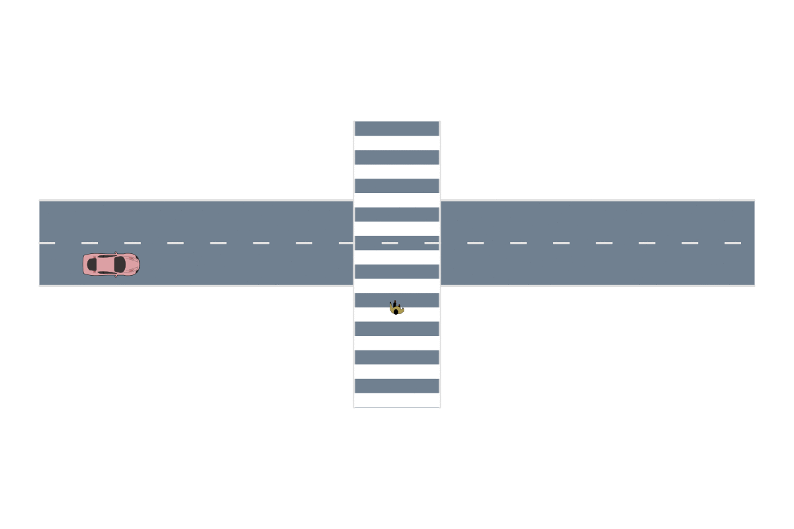
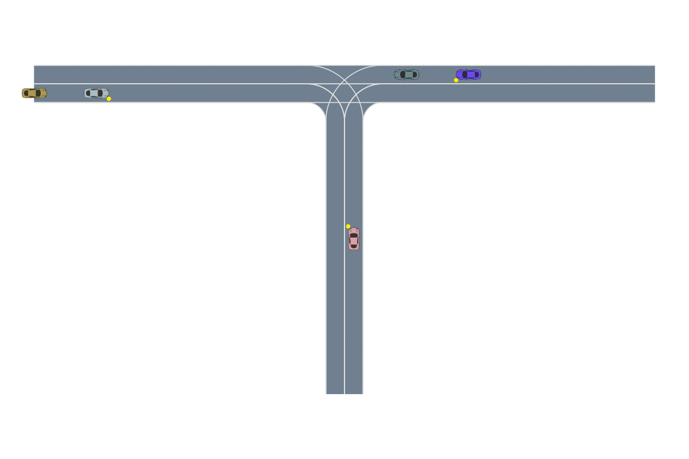

# Adversarial Driving
This package provides MDP models for safety validation of autonomous vehicles. It is built on top of [AutomotiveSimulator.jl](https://github.com/sisl/AutomotiveSimulator.jl).

The actions of the `AdversarialDrivingMDP` represent disturbances to adversarial agents on the road. The reward is designed to encourage critical scenarios for the ego vehicle.

For a quick start, look at the two scenarios in `examples/`. The output of those examples are shown in the following gifs.

Nominal Behavior             |  Failure Example
:-------------------------:|:-------------------------:
  |  
  |  

## Usage
The `AdversarialDrivingMDP` is very versatile in its construction and supports the following arguments
* `sut::Agent` - The system under test (SUT) or ego-vehicle. This is the entity that the safety validation is being performed upon.
* `adversaries::Array{Agent}` - The list of adversaries on the road with the SUT.
* `road::Roadway` - The roadway defined in `AutonomotiveSimulator.jl`.
* `dt::Float64` - Simulation timestep.
* `other_agents::Array{Agent}` - Other agents on the road that are not being controlled as adversaries and are not the SUT. Default: `Agent[]`.
* `γ` - Discount factor on future rewards. Default: `1`.
* `ast_reward` - Whether or not to use the AST reward, defined [here](https://arxiv.org/abs/2004.04293). Default: `false`.
* `no_collision_penalty` - Penalty (in AST reward) for not finding a collision. Default: `1e3`.
* `scale_reward` -  Whether or not to scale the reward so it is in the range [-1,1]. Default: `true`.
* `end_of_road` - Define an early end of the road. Default: `Inf`.